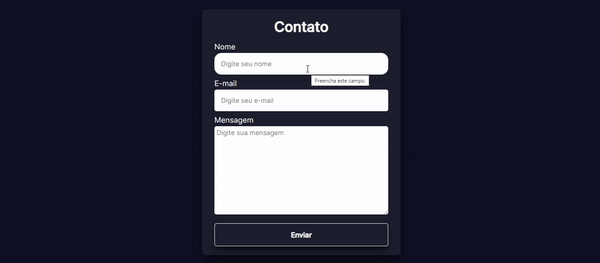
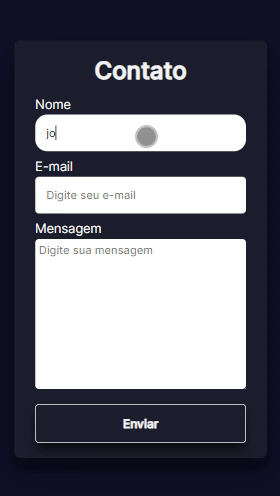

# Formulário

## Resumo

Este é um [formulário](https://ezequiel-lee.github.io/formulario/) responsivo de contato onde usei a API do StaticForms para fazer o processo de envio.

# Tecnologias Utilizadas

 
  
	

## Veja o funcionamento!
### Desktop

Neste GIF animado, você pode conferir o projeto no Desktop em pleno funcionamento e responsivo.

### Mobile

Neste GIF animado, você pode conferir o projeto no Mobile em pleno funcionamento e responsivo.

## Acesse o Projeto

Você pode acessar o projeto através do link abaixo:

➜ [Link do Projeto](https://ezequiel-lee.github.io/formulario/)

